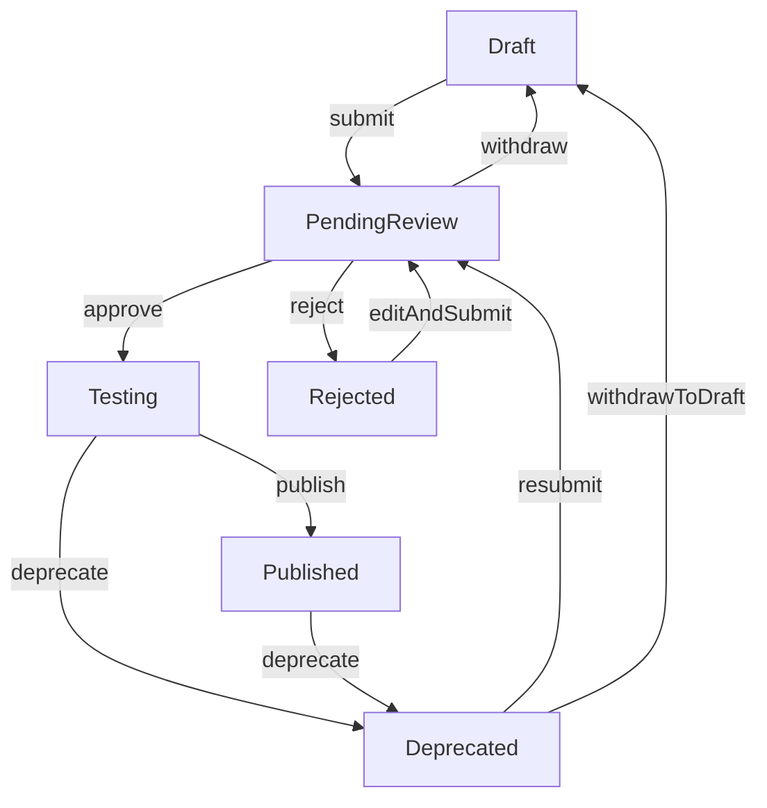
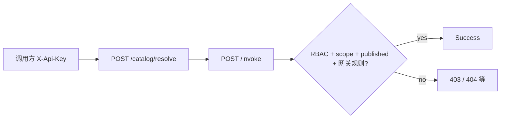
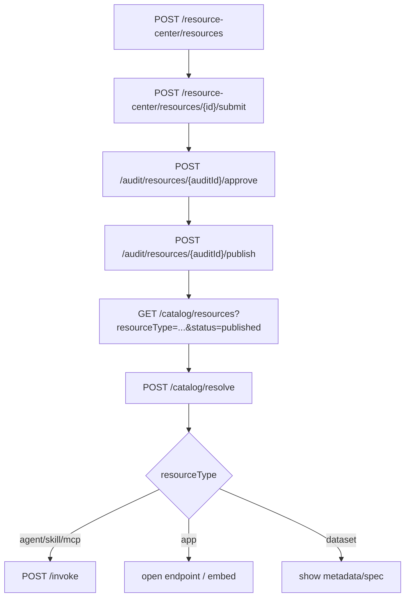

# 五类资源注册-审核-授权-调用超详细实施文档（后端真值版）

> 版本：v1.0  
> 适用对象：前端开发、产品、测试、联调负责人  
> 目标：避免前端流程继续“想当然”，按后端真实能力完整落地 `mcp/agent/skill/dataset/app` 五类资源闭环  
> 后端上下文路径以部署为准（`server.servlet.context-path`，常见为 `/api` 或 `/regis`），与前端 `VITE_API_BASE_URL` 一致。

---

## 1. 一句话结论（先统一认知）

- 后端已经打通五类资源的主链路：**注册 -> 提审 -> 审核 -> 发布 -> 目录可见 -> 使用/调用**。
- 上架不是一步：**`approve` 不等于上架**，必须再执行 `publish` 才到 `published`。
- 统一网关消费：**`API Key + Scope + published（及资源可见性）`** 为主；**每资源 Grant 表对 invoke/目录已不做拦截**（实现见 `ResourceInvokeGrantService` 注释）。
- 五类资源都能注册，但“使用方式”不同（与 `PRODUCT_DEFINITION.md` §2–§3 一致）：
  - `agent` / `mcp`：可走统一调用 `POST /invoke`（MCP 流式用 `invoke-stream`）。`mcp` 可登记 **前置 Hosted Skill**，网关内在转发上游前按链归一化 JSON（见 `docs/改造计划/platform-transformation-spec-freeze.md`）。
  - `skill`：**技能包（`execution_mode=pack`）** 仍禁止 `POST /invoke`；**托管技能（`execution_mode=hosted`）** 可走 `invoke`（平台代调 LLM）。远程工具请登记 `mcp`。
  - `app`：主要是 `resolve` 后拿 URL 跳转/嵌入；`invoke` 多为 redirect/票据语义。
  - `dataset`：主要是元数据消费（`invokeType=metadata` 等），**无**通用统一 `invoke` 执行模型。

---

## 2. 角色与职责（前端必须按角色设计页面）

## 2.1 角色定义

- 开发者（developer）
  - 创建/更新自己的资源
  - 提审自己的资源
  - 下线自己的资源
  - （历史）per-resource Grant / 授权工单已下线，无独立「授权管理」主路径
- 部门管理员（dept_admin）
  - 审核资源（approve/reject/publish）
  - 可操作资源（由后端 owner/admin 判断）
- 平台管理员（platform_admin）
  - 同部门管理员，且具备更高全局权限

## 2.2 前端页面建议映射

- 开发者侧
  - 我的资源列表（按类型分 tab）
  - 创建/编辑页面（五类动态表单）
  - 提审/下线/版本页面
- 管理员侧
  - 审核列表（pending_review）
  - 审核详情（approve/reject/publish）
- 用户/调用侧
  - 资源市场（目录）
  - 资源详情（resolve）
  - 调用页（invoke，仅对可调用类型）

---

## 3. 全局接口总览（闭环主链）

## 3.1 注册中心（资源拥有者）

- **消费策略 `accessPolicy`（历史）**：主表 `t_resource.access_policy` 仍可能出现在 OpenAPI/旧稿中；**网关 invoke 不以本字段拦截**。注册实现已将新建/更新统一为 `open_platform`（见 `ResourceRegistryServiceImpl`）；**不要**再按「grant_required=须 Grant」理解行为。
- `POST /resource-center/resources` 创建资源（初始 `draft`）
- `PUT /resource-center/resources/{id}` 更新资源
- `DELETE /resource-center/resources/{id}` 删除（受状态机限制）
- `POST /resource-center/resources/{id}/submit` 提审（进入 `pending_review`）
- `POST /resource-center/resources/{id}/withdraw` 撤回提审（回 `draft`）
- `POST /resource-center/resources/{id}/deprecate` 下线（通常从 `published/testing` 到 `deprecated`）
- `GET /resource-center/resources/mine` 我的资源分页
- `GET /resource-center/resources/{id}` 资源详情（owner 或 admin）

## 3.2 审核中心（管理员）

- `GET /audit/resources` 待审核列表（`pending_review`）
- `POST /audit/resources/{auditId}/approve` 审核通过（到 `testing`）
- `POST /audit/resources/{auditId}/reject` 审核驳回（到 `rejected`）
- `POST /audit/resources/{auditId}/publish` 发布（**testing → published**）。服务层校验：调用者须为 **资源 owner**、**与 owner 同 `menu_id` 的 dept_admin** 或 **platform_admin/admin**（`ensureMayPublishAuditedResource`）；`@RequireRole` 含 `developer`、`dept_admin`、`platform_admin`、`admin`。
- `POST /audit/resources/{id}/platform-force-deprecate` **平台强制下架**（body 可选 `{"reason"}`），**仅 platform_admin** → 资源 `deprecated`，并与开发者自助 `POST /resource-center/resources/{id}/deprecate` 区分。

## 3.2.1 ~~授权申请工单~~（已下线）

**2026-04-09 起**：表 `t_resource_grant_application` 与 `t_resource_invoke_grant` 已删除，`/grant-applications*`、`/resource-grants*` 控制器已移除。消费侧以 **API Key + scope + published** 为准。个人设置下 `GET /user-settings/api-keys/{apiKeyId}/resource-grants` 仅占位返回空数组。

## 3.3 市场/解析/调用

- **目录类型权限**：登录用户按 Casbin 权限过滤资源类型（`GatewayUserPermissionService`）：`agent` 需 `agent:read` 或 `skill:read`；`skill`/`mcp` 需 `skill:read`；`app` 需 `app:view`；`dataset` 需 `dataset:read`。系统预置 **`consumer`** 角色仅含上述只读权限，适合「只逛市场」账号。`/catalog/resources/trending` 与 `/catalog/resources/search-suggestions` 与主列表使用**同一**类型谓词。
- `GET /catalog/resources` 目录列表
- `GET /catalog/resources/{type}/{id}` 按类型详情解析；`include` 可含 **`closure` 或 `bindings`**，响应 `bindingClosure` 为绑定无向闭包资源摘要。
- `POST /catalog/resolve` 统一解析
- `GET /catalog/capabilities/tools?entryResourceType=&entryResourceId=` **（可选 BFF）** 对闭包内 MCP 聚合 `tools/list`，返回 OpenAI tools 形态与 `routes` 映射（须 `X-Api-Key`，入口 resolve scope + 各 MCP invoke scope）。
- `POST /invoke` 统一调用（必须 `X-Api-Key`）。**绑定展开**：若 `resourceType=agent` 且登记了 `agent_depends_mcp`，或 `resourceType=skill`（hosted）且存在指向该技能的 `mcp_depends_skill`，网关在转发/代调前会对相关 MCP 拉取 `tools/list`，将 `openAiTools`、`routes`、`warnings`、`entry` 合并进 **`payload._lantu.bindingExpansion`**（仅覆盖该子键，保留调用方在 `_lantu` 下的其它扩展）。**单独 invoke `mcp` 不会**反向追加 Agent。各 MCP 须当前 Key **invoke** scope；无权限的 MCP 记入 `warnings`。开关：`lantu.gateway.binding-expansion`（`enabled` / `agent` / `hosted-skill`）。

**`X-Api-Key` 填什么（与列表里看到的不同）**

- 创建接口 `POST /user-settings/api-keys` 或 `POST /user-mgmt/api-keys` 成功后，响应体 **`data.secretPlain`** 为完整可调用密钥（形如 `sk_` + 32 位十六进制），**仅在此一次响应中返回**，前端须提示用户立即复制保存。
- 列表/详情里常见的 **`maskedKey`（如 `sk_3****`）、`prefix`、`id`（表主键）都不能**当作 `X-Api-Key` 传入：网关会对请求头**整串**做 SHA-256，与库中 `key_hash` 比对；遗失明文只能删除该 Key 后重建。

## 3.4 ~~资源级逐 Key 授权~~（已下线，2026-04-09）

- **真值**：`t_resource_invoke_grant` / `t_resource_grant_application` **已删除**；无 `POST/GET/DELETE /resource-grants*`、无 `/grant-applications*`。`ResourceInvokeGrantService.ensureApiKeyGranted` **不**再读 Grant 表，仅保留 owner/平台 Key 等与资源存在性相关规则；调用以 **API Key、scope、published** 为主。个人设置 `GET /user-settings/api-keys/{apiKeyId}/resource-grants` 仅占位返回 `[]`。

### 3.4.1 绑定字段（注册 JSON）

- **Agent**：`relatedResourceIds`（`agent_depends_skill`，历史）、`relatedMcpResourceIds`（`agent_depends_mcp`）。**invoke 侧**：仅调 Agent 时，网关可将绑定 MCP 的工具聚合写入上游请求体 `_lantu.bindingExpansion`（见上），**不会**在仅调 MCP 时反向拉起 Agent。
- **MCP**：`relatedPreSkillResourceIds`（`mcp_depends_skill`，顺序为前置链）。**invoke 侧**：转发 MCP 前仍按链跑前置 Hosted Skill；不追加 Agent。
- **Skill**：`executionMode`：`pack` | `hosted`；hosted 须 `hostedSystemPrompt` 等（见 `ResourceUpsertRequest` / Swagger）。**invoke 侧**：若有 MCP 通过 `mcp_depends_skill` 绑定到该技能，网关在 Hosted LLM 调用前将同源工具聚合写入 **`payload._lantu.bindingExpansion`**（与 Agent 展开字段一致；当前仍为单次 chat，不自动代执行 `tools/call`）。

## 3.5 开发者 owner 维度统计

- `GET /dashboard/owner-resource-stats?ownerUserId=&periodDays=7`：**须** `X-User-Id`。默认统计当前用户名下资源；部门管理员可传 **本部门开发者** 的 `ownerUserId`；平台管理员可查任意 owner。
- 指标：`t_call_log` 网关调用总量/成功量、按资源类型拆分；`t_usage_record` 中 `action=invoke` 且可归因到该 owner 资源的条数（可能与 call_log 重复，仅供对照）；`t_skill_pack_download_event` 技能包成功下载次数（下载接口流式完成后写入）。

---

## 4. 生命周期状态机（前端按钮可见性的唯一依据）

## 4.1 状态定义

- `draft`：草稿，未提审
- `pending_review`：待审核
- `testing`：审核通过待发布（灰度/测试阶段）
- `published`：已发布（可视为上架）
- `rejected`：驳回
- `deprecated`：下线

## 4.2 状态流转图



## 4.3 按状态的前端动作矩阵

- `draft`
  - 可见按钮：编辑、删除、提审、创建版本、切换版本
  - 不应显示：发布
- `pending_review`
  - 开发者可见：撤回提审
  - 管理员可见：通过、驳回
  - 不应允许编辑/删除
- `testing`
  - **发布**：资源 owner、同部门 dept_admin 或 platform_admin/admin（`ensureMayPublishAuditedResource`）；驳回仍可由审核管理员操作（按产品策略）
  - 开发者可见：下线（若业务允许）
- `published`
  - 可见：下线、查看、使用（按类型）
  - 不应允许直接编辑（需先走状态操作后再改）
- `rejected`
  - 可见：编辑、重新提审、删除
- `deprecated`
  - 可见：重新提审（或回草稿再改）

---

## 5. 五类资源字段规范（创建/更新）

## 5.1 公共字段（五类都带）

请求体：`ResourceUpsertRequest`

- `resourceType`（必填）：`mcp|agent|skill|dataset|app`
- `resourceCode`（必填）：同类型唯一编码，建议 `a-z0-9-` 风格
- `displayName`（必填）：展示名
- `description`（选填）：描述
- `sourceType`（选填）：来源，如 `internal/cloud/department/...`
- `providerId/categoryId`（选填）：归属信息

## 5.2 MCP 必填字段

- `endpoint`（必填）
- `protocol`（建议填，默认按后端逻辑可落到 `mcp`）
- `authType`（选填，默认 `none`）
- `authConfig`（选填 JSON）

示例：

```json
{
  "resourceType": "mcp",
  "resourceCode": "campus-kb-mcp",
  "displayName": "校园知识库MCP",
  "description": "MCP知识检索服务",
  "sourceType": "internal",
  "endpoint": "http://localhost:9000/mcp",
  "protocol": "mcp",
  "authType": "none",
  "authConfig": {
    "method": "tools/call"
  }
}
```

## 5.3 Agent 必填字段

- `agentType`（必填）
- `spec`（必填，通常包含 `url`）
- 可选：`mode/maxConcurrency/maxSteps/temperature/systemPrompt/isPublic/hidden`

## 5.4 Skill 必填字段

- `skillType`（必填）
- `spec`（必填，通常包含 `url`）
- 可选：`mode/parametersSchema/parentResourceId/displayTemplate/isPublic/maxConcurrency`

## 5.5 Dataset 必填字段

- `dataType`（必填）
- `format`（必填）
- 可选：`recordCount/fileSize/tags/isPublic`

## 5.6 App 必填字段

- `appUrl`（必填）
- `embedType`（必填，如 `iframe` / `micro_frontend`）
- 可选：`icon/screenshots/isPublic`

---

## 6. 审核与上架（关键误区纠正）

## 6.1 为什么“通过后还没上架”

后端是分段状态：

1. `approve`：`pending_review -> testing`
2. `publish`：`testing -> published`

只有 `published` 才应在前端标记为“已上架可用”。

## 6.2 审核接口调用顺序（管理员）

1) 审核列表拉取 `GET /audit/resources?resourceType=mcp&page=1&pageSize=20`  
2) 通过：`POST /audit/resources/{auditId}/approve`  
3) 发布：`POST /audit/resources/{auditId}/publish`  

驳回路径：`POST /audit/resources/{auditId}/reject`（body 要有 `reason`）

---

## 7. 调用侧校验模型（不是授权链接；无逐资源 Grant）

## 7.1 典型约束（按路径叠加）

对已发布资源的 **catalog / resolve / invoke**（具体以类型与实现为准），调用方通常需同时满足：

1. **有效 `X-Api-Key`**（及 Key 状态为 active 等）
2. **API Key scope** 覆盖当前动作（如 `catalog`、`resolve`、`invoke` 或 `*`）
3. **资源生命周期**：常见要求资源为 **`published`** 且未被删除；部分路径还需 **RBAC**（带 `X-User-Id` 时由 `GatewayUserPermissionService` 等按资源类型过滤）
4. **网关规则**：`ResourceInvokeGrantService` 中对 owner Key、平台 Key 等等价短路（**不**再查 Grant 表）

历史字段 **`access_policy`** 仍可出现在 JSON 中，**不要**按「须额外 Grant 行」理解。

## 7.2 流程图（Grant 已下线后）



## 7.3 ~~逐资源授权 CRUD~~

**已删除**。请勿再对接 `POST /resource-grants` 等路径；第三方接入文案写 **平台发放的 API Key + 所需 scope**，不写「向资源 owner 申请 Grant」。

## 7.4 常见误区

- 误区1：只要有 scope 就一定 resolve/invoke 成功  
  - 错：资源可能非 `published`、类型不允许调用、或 Key 与资源状态不满足网关规则。
- 误区2：`accessPolicy=grant_required` 表示必须找 owner 开 Grant  
  - 错：该值为历史枚举；迁移后库中多为 `open_platform`，且网关 **不**再按 Grant 表裁决。
- 误区3：存在「授权链接」可免 Key  
  - 错：调用链仍以 **API Key**（及 scope）为主；App 启动等若有 ticket，见 `AppLaunchTokenService` 等专门文档。

---

## 8. 目录、解析、调用的前端时序（可直接做页面流程）

## 8.1 统一时序图



## 8.2 接口头部规范（前端必须统一）

- 管理类接口（资源注册、审核等）：
  - `Authorization: Bearer <token>`
  - `X-User-Id`（由认证链路注入或透传）
- 目录/解析：
  - 至少一项：`X-User-Id` 或 `X-Api-Key`
- 调用：
  - `X-Api-Key` 必填
  - `X-User-Id` 可选
  - `X-Trace-Id` 推荐

## 8.3 `/invoke` 请求示例（仅可调用类型）

```json
{
  "resourceType": "mcp",
  "resourceId": "29",
  "version": "v1",
  "timeoutSec": 30,
  "payload": {
    "method": "tools/call",
    "params": {
      "name": "search",
      "arguments": {
        "query": "招生政策"
      }
    }
  }
}
```

---

## 9. 五类资源“使用方式差异”细化（前端必读）

## 9.1 MCP

- 目标：工具协议调用（通常 `mcp/jsonrpc`）
- 推荐前端动作：
  1) 目录筛选 `resourceType=mcp`
  2) resolve 得 endpoint/spec
  3) invoke 走 API Key
- **HTTP 传输（含 Streamable HTTP / SSE）**：网关代发 MCP 出站请求会带 **`Accept: application/json, text/event-stream`**（可配 `lantu.integration.mcp-http-accept`）。上游若要求「同时接受 JSON 与 event-stream」，缺少该头会 **406**，与「平台没配参数」表现类似，实为 **协议头未满足**。
- **`payload` 形状**：与 **§8.3** 一致——JSON-RPC 的 **`params` 放在 `payload.params`**（例如 `tools/call` 的 `name` / `arguments`）；不要把整段 `{ method, params }` 当作 JSON-RPC 的 `params` 一层包住（后端已按 §8.3 拆解）。
- **`payload.method` 与资源 spec**：网关 **优先使用本次 `payload.method`**（`initialize` / `tools/list` / `tools/call`）；不要在 MCP 的 `auth_config`/spec 里长期存 **`method: tools/call`** 当作默认值去压过请求体，否则 `initialize` 会被错发成 `tools/call` 并出现 **`params.name` 缺省** 类错误。
- UI 标记：可调用资源

## 9.2 Agent

- 目标：子智能体/HTTP Agent 服务
- 走法与 MCP 类似，主要差异在 `spec` 结构与 `agentType`

## 9.3 Skill

- 目标：工具型能力（HTTP/MCP 子能力）
- 同样可 resolve + invoke

## 9.4 Dataset

- 目标：数据资产元信息消费，不是通用远程执行入口
- resolve 后主要用 `spec`（格式、规模、标签）
- 前端应提供：浏览、申请、绑定等业务动作（而非强制 invoke）

## 9.5 App

- 目标：应用跳转/嵌入
- resolve 返回 `invokeType=redirect` + `endpoint`
- 前端动作：打开 URL 或按 `embedType` 嵌入
- 不建议走统一 invoke 当作 HTTP 工具调用

---

## 10. 版本管理（避免“更新覆盖线上”）

## 10.1 创建版本

`POST /resource-center/resources/{id}/versions`

```json
{
  "version": "v2",
  "makeCurrent": true
}
```

- `version` 必填，长度 <= 32（后端校验）
- `makeCurrent=true` 会切当前版本

## 10.2 切换版本

- `POST /resource-center/resources/{id}/versions/{version}/switch`
- 仅 active 版本可切

## 10.3 查询版本

- `GET /resource-center/resources/{id}/versions`
- 前端建议展示：当前版本标识、创建时间、状态

---

## 11. 前端“分子级”落地清单（逐页面）

## 11.1 创建页（五类动态表单）

- 表单第一步选择 `resourceType`
- 按类型渲染必填字段（本文件第5章）
- 提交前本地校验：
  - 字段必填
  - URL 基础格式（mcp endpoint、appUrl、spec.url）
  - 数值边界（timeout、并发等）
- 成功后进入资源详情页，状态应显示 `draft`

## 11.2 我的资源页

- 统一读 `GET /resource-center/resources/mine`
- 按状态渲染按钮（第4.3）
- 关键按钮行为：
  - 提审 -> `/submit`
  - 撤回 -> `/withdraw`
  - 下线 -> `/deprecate`
  - 删除 -> `DELETE`

## 11.3 审核页（管理员）

- 列表：`GET /audit/resources`
- 行操作：
  - 通过 -> `approve`
  - 驳回 -> `reject`（必须填写 reason）
  - 发布 -> `publish`
- 强提醒：
  - 通过后卡片状态应显示 `testing`，不要显示“已上架”
  - 发布成功后才显示“已上架/可使用”

## 11.4 市场页

- 为避免草稿泄露，建议默认查询：`status=published`
- 按类型分市场 tab：
  - MCP 市场：`resourceType=mcp`
  - Agent 市场：`resourceType=agent`
  - Skill 市场：`resourceType=skill`
  - Dataset 市场：`resourceType=dataset`
  - App 市场：`resourceType=app`

## 11.5 使用页

- 统一先 resolve
- 再按类型分流：
  - `mcp/agent/skill` -> invoke
  - `app` -> URL 打开/嵌入
  - `dataset` -> 展示 metadata/spec

## 11.6 ~~授权管理页~~（已下线）

逐资源「把某 Key 授权到某资源」的页面与接口 **已不存在**。第三方接入文案：**申请/配置具备所需 scope 的 API Key**；已发布资源在 scope 满足时按网关规则调用，**无需** Grant 工单。

---

## 12. 常见错误码与排查动作（联调必备）

- 401 未认证
  - 检查 `Authorization` 或 `X-Api-Key` 是否缺失/过期
- 403 无权限
  - 检查 RBAC 是否有类型访问权限
  - 检查 API Key scope 是否覆盖动作
  - 检查资源是否 `published` 及网关错误提示（**不再**排查 Grant 表）
- 404 不存在
  - 资源 ID、类型、版本号是否匹配
- 400 参数错误
  - 字段必填、JSON 结构、类型值是否合法
- 500 服务异常
  - 优先看后端日志 SQL/序列化/连接错误栈

---

## 13. 联调验收清单（测试用）

## 13.1 MCP 完整验收

1. 开发者创建 MCP 成功（状态 `draft`）  
2. 提审成功（状态 `pending_review`）  
3. 管理员 approve 后状态 `testing`  
4. 管理员 publish 后状态 `published`  
5. 市场 `resourceType=mcp&status=published` 可见  
6. resolve 返回 endpoint/spec 正确  
7. invoke 可成功  
8. **另一用户**的有效 Key：若 scope 不足或非 published，应拒绝；scope 正确且资源已发布则 **应允许**（无 Grant 行概念）  
9. ~~授权 / 撤销 Grant~~：接口已删除，验收删除本步骤  
10. 复核：403 原因应来自 **scope / 状态 / RBAC**，而非「无 Grant」

## 13.2 其余四类验收最小集

- Agent/Skill：同 MCP 全链路（包含 invoke）
- App：发布后可 resolve，前端可按 endpoint 正常跳转/嵌入
- Dataset：发布后可 resolve，前端展示元数据字段完整

---

## 14. 最后两条硬规则（防再跑偏）

- 规则1：**任何“上架成功”文案必须以 `published` 为准**，不能以 `approve` 为准。  
- 规则2：**对接集成文案以「API Key + scope + published」为准**；勿再写「逐资源 Grant / 授权工单」主路径。App 等若有 launch ticket，单独说明。

---

## 15. 关键后端代码参考（联调时建议并读）

- `src/main/java/com/lantu/connect/gateway/controller/ResourceRegistryController.java`
- `src/main/java/com/lantu/connect/gateway/service/impl/ResourceRegistryServiceImpl.java`
- `src/main/java/com/lantu/connect/gateway/service/support/ResourceLifecycleStateMachine.java`
- `src/main/java/com/lantu/connect/audit/controller/AuditController.java`
- `src/main/java/com/lantu/connect/audit/service/impl/AuditServiceImpl.java`
- `src/main/java/com/lantu/connect/gateway/controller/ResourceCatalogController.java`
- `src/main/java/com/lantu/connect/gateway/service/impl/UnifiedGatewayServiceImpl.java`
- `src/main/java/com/lantu/connect/gateway/security/ResourceInvokeGrantService.java`
- `src/main/java/com/lantu/connect/gateway/security/ApiKeyScopeService.java`

